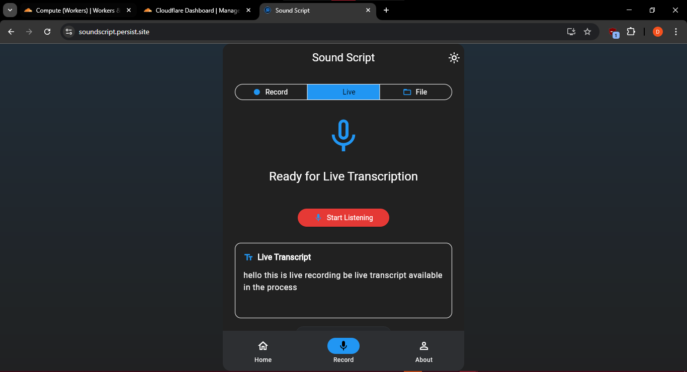
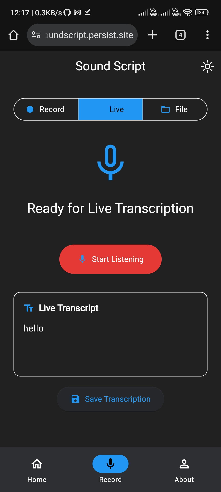

# SoundScript

Convert speech to text with intelligent transcription

Record audio and get accurate text transcriptions with word-level timestamps.

## How It Works

1. **Record**: Capture audio using device microphone or upload audio files
2. **Upload**: Send audio to AssemblyAI speech-to-text API
3. **Transcribe**: Get word-level timestamps and accurate text conversion
4. **Play**: Synchronized playback with text highlighting
5. **Live**: Real-time transcription while recording

## API Used

**[AssemblyAI](https://www.assemblyai.com/)** - Professional speech-to-text API with high accuracy and word-level timestamps

- Upload endpoint for audio files
- Transcription processing with real-time status
- Word-level timing for synchronized playback
- Live streaming transcription support

## Details

**Features**: High-quality recording, real-time transcription, synchronized playback, cross-platform support

**Platforms**: Android app and web version

**Requirements**: Android 6.0+ or modern web browser

**Permissions**: Microphone access, Internet connection

[Download APK](https://github.com/sunnydodti/sound-script/releases/latest) | [Try Web App](https://soundscript.persist.site) | [Issues](https://github.com/sunnydodti/sound-script/issues)

## Gallery

**Dark Mode**

 |  |  | 
--- | --- | --- | ---

**Light Mode**

 |  | 
--- | --- | ---

**Web UI**

Desktop View | Mobile Web
--- | ---
 | 
